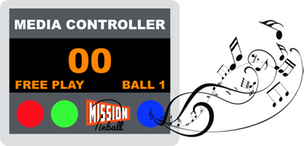

Mission Pinball Framework - Media Controller (mpf-mc)
=====================================================

This package is for the "Media Controller" for the Mission Pinball Framework (MPF).

The architecture of MPF breaks the pinball software into two pieces. The core engine which controls the pinball machine
and runs the game logic is in the MPF package. Separate from that is the Media Controller which controls the display and
sound, including the DMD, Color DMD, RGB LED DMD, and/or onscreen or LCD display. (Note that you need a media controller
to drive a DMD and sound even if you don't have an on-screen LCD window. Don't worry--you can run this headless and/or
in a console-only environment for those cases.)

This package (mpf-mc) is MPF's "in box" media controller which is based on Kivy and Python 3. It leverages OpenGL and the
GPU of the computer it's running on. There's also [another media controller option based on Unity 3D](https://github.com/missionpinball/unity-bcp-server) you can use instead.

MPF-MC can run on Windows, OS X, and Linux. It can run on the same machine as the core MPF engine, or it can be a
separate machine. It runs as a separate process from MPF, so it works well on a multi-core computer.

The MPF project homepage is here : http://missionpinball.org

Installation, Documentation, and Examples
-----------------------------------------
* Getting started tutorial : http://docs.missionpinball.org/en/latest/tutorial/
* Installation : http://docs.missionpinball.org/en/latest/install/
* User documentation : http://docs.missionpinball.org
* API / developer documentation : http://docs.missionpinball.org/en/latest/api/

Support
-------
We have a user support forum at : https://groups.google.com/forum/#!forum/mpf-users

Authors & Contributing
----------------------
MPF and the MPF-MC are labors of love by awesome pinball-loving people. There's a list of authors in the AUTHORS file.
We'd love for you to join us! Even if you don't know Python well, there's plenty to do. Drop us a line in the forum, or
make a change and submit a pull request! More info [here](http://docs.missionpinball.org/en/latest/about/contributing_to_mpf.html).

License
-------
* MPF and the MPF-MC are released under the terms of the MIT License. Please refer to the LICENSE file for details.
* The MIT license basically means you can do anything you want with MPF, including using it for commercial projects.
  You don't have to pay us or share your changes if you don't want to.
